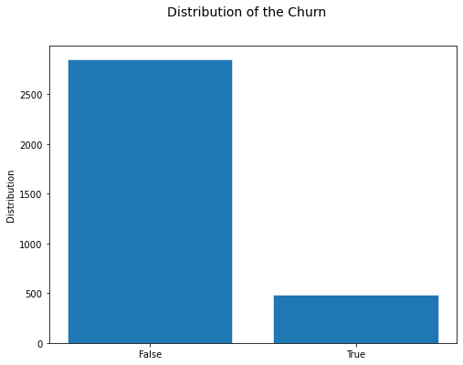
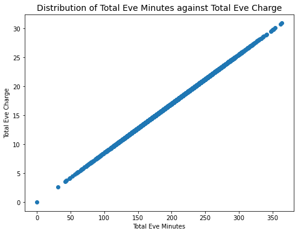
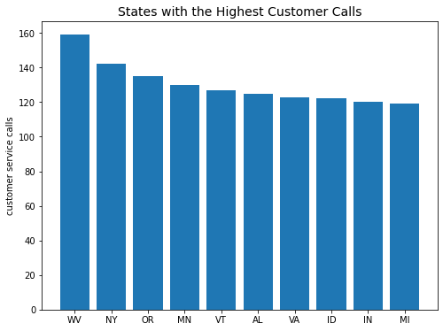
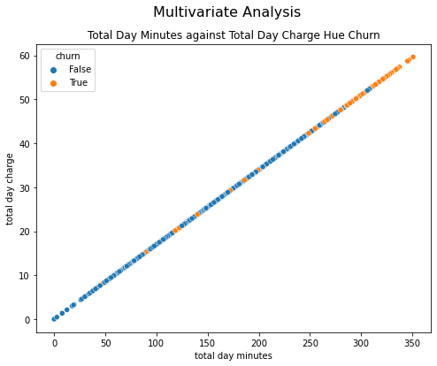

# SYRIA TELECOMMUNICATIONS LIMITED

## Overview

The telecommunications industry worldwide brags as being one of the few industries with the most stiff competition and unstable business conditions for any soft hearted telecommunications companies.
Customer retention rates rock violently from side to side due to economic downturns, increased costs, competitive alternatives, increased technology, globalization, government interference and restrictions, among many other factors.

## Business and Data Understanding

### Business Understading

Management of Syria Telecommunications Limited realize the potential losses arising from this rampant churning of its customers from, what it thought to be, it’s firm grasp.
The Data Science Department has been tasked with obtaining, scrubbing, exploring, and understanding the patterns with it’s customers and recommending any steps to be followed.

**Business Problem and Challenge**

Syria Telecommunications faces a downward trajectory in terms of customer retention which would inevitably lead to a deviation from the business goals of maintaining and increasing market share and maximising profitability.

**Objectives**

Our objective are

1. To identify factors leading to increased churn rates
2. To create a classification model that predicts whether a customer will churn with a recall of over 80%
3. To give customer retention recommendations

**Brief Solution**

This kind of situation calls represents a classification problem where the best model according to the project proved to be Random Forest with Hyperparameter Tuning and different ranges of train test splits.

### Data Understanding

The data was sourced from Kaggle and was stored in a CSV file format.
The data contained 3,333 rows and 21 records.

Key Features include:

> - Minutes and Calls – Consumer’s purchase of minutes and calls made to the domestic and international regions
> - Charges – Charges billed to consumers for making their domestic calls during the day, evening and night, and international calls.
> - Subscriptions – A binary value indicating if the consumer has an international plan or a voice mail
> - Customer Service Calls – Number of times a user has called the customer service
> - Churn - This binary feature indicates if the user left the company.
> - Account Length – period of time the user maintained their account.

### Data Cleaning

The data received had no missing values and no duplicate values. Records were well kept.

Some cleaning aspects done:

> - Conversion of numerical features to categorical.
> - Conversion of boolean features to strings.
> - Droping features.

## Data Analysis

**_Churn_**

> Nearly 15% of customers churned in the period.

**_Minutes against Charge_**

> There is a linear relationship between charges and minutes purchased.
>
> > This relationship was the same for minutes purchased for domestic (day, evening and night) and international minutes and their charges.

**_State against Customer Service Calls_**

> The top 10 states with the highest number of calls made to the customer service center
>
> > This could potentially present problem areas that should be sorted to prevent further churning.

**_Charges against Call Rates Hue Churn_**

> High paying customers who churned made fewer calls to the customer service center.
> Additionally, low paying customers churned after making multiple calls to the customer service center.

## Modelling

_Preprocessing steps_ followed in this model include:

1. LabelEncoding - conversion of values to a certain predefined label
2. OneHotEncoding - encodes any categorical features.
3. StandardScaling - scales all the numerical features.

_Models_ explored in this project include:

- Dummyclassifier
- Logistic Regression
- K Nearest Neighbors Classifier
- Decision Tree Classifier
- Random Forest Classifier
- Gradient Boost Classifier
- Ada Boost Classifier
- XGBoost Classifier

Each model's advantages and disadvantages are highlighted to give caution to the reader.

## Evaluation

Evaluation metrics for this model focused primarily on recall.

Each model was given the same set of data and the models competitively scored the test data after training their models before any hyper parameter tuning.

The best models for this project were Random Forest Classifier and the XGBoost. These classifiers were then tested further after hyper parameter tuning and finding the best train-test ratios that maximised the accuracy.

In the end Random Forest proves to be the best model with a high recall score of 80%.

## Conclusion and Recommendations

The high recall score means that the model can identify many customers who churn as true positive values, with very few customers being misclassified as non-churners.

Recommendations to ensure Syria Telecommunications retaining of the 80% predicted churners could include but are not limited to:

- Bespoke packages, Incentives and Rewards – Minutes, Voice Mail and International Plans could be bundled together
- Trained Customer Service Agents and Customer Feedback Recording
- Upgrade Technology in problem areas where there are high customer service rates.
- Re-evaluation of price points by using a mix of linear and constant prices.
